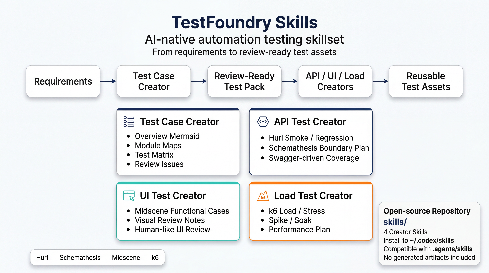

# TestFoundry Skills

AI-native automation testing skillset that turns requirements into review-ready test cases, API tests, UI tests, and load tests.



## 项目简介

`TestFoundry Skills` 是一组面向 AI Agent 的自动化测试 Creator Skills，用来把需求文档逐步转换为评审可用、可追踪、可继续自动化生成的测试资产。

这套技能集当前聚焦 4 个环节：

- `test-case-creator`
  从需求文档产出测试总览图、模块图、测试矩阵和评审问题清单。
- `api-test-creator`
  从已评审测试用例和 `swagger.json` 产出 `Hurl` 主回归脚本与 `Schemathesis` 边界测试计划。
- `ui-test-creator`
  从已评审测试用例和页面 URL 产出 `Midscene` 功能路径用例与视觉布局评审清单。
- `load-test-creator`
  从已评审测试用例和性能目标产出 `k6` 压测方案与场景骨架。

## 适用对象

适合这些团队或个人：

- 需要把需求文档系统化地转成测试资产
- 希望让 AI Agent 参与测试设计与脚本生成
- 接口测试使用 `Hurl + Schemathesis`
- UI 自动化使用 `Midscene`
- 压测使用 `k6`

不适合这些场景：

- 想直接获得可执行业务测试结果，而不提供需求、接口文档或页面环境
- 想把这套仓库当成业务测试工程本身
- 想在首版中获得执行器、CI 工作流或项目级脚手架

## 技能一览

| Skill | 主要输入 | 主要输出 | 角色定位 |
| --- | --- | --- | --- |
| `test-case-creator` | 需求文档 | 总览 Mermaid、模块 Mermaid、测试矩阵、评审问题清单 | 测试设计与评审入口 |
| `api-test-creator` | 已评审测试用例、`swagger.json` | `smoke.hurl`、`regression.hurl`、`schemathesis-plan.md` | API 验收测试生成 |
| `ui-test-creator` | 已评审测试用例、页面 URL | `midscene-functional-cases.md`、`midscene-visual-review.md` | UI 自动化与人工式视觉评审 |
| `load-test-creator` | 已评审测试用例、性能目标、接口信息 | `k6-plan.md`、`k6-scenarios.js` | 压测方案与脚本骨架生成 |

## 推荐工作流

```text
需求文档
  -> test-case-creator
  -> 测试总览图 + 模块图 + 测试矩阵 + review-issues
  -> 测试用例评审通过
  -> api-test-creator + ui-test-creator + load-test-creator
  -> API / UI / Load 测试资产
```

更具体的输入关系：

- 需求文档 -> `test-case-creator`
- 已评审测试用例 + `swagger.json` -> `api-test-creator`
- 已评审测试用例 + 网站 URL -> `ui-test-creator`
- 已评审测试用例 + 性能目标 -> `load-test-creator`

## 目录结构

```text
test-foundry-skills/
├── LICENSE
├── README.md
├── .gitignore
└── skills/
    ├── test-case-creator/
    ├── api-test-creator/
    ├── ui-test-creator/
    └── load-test-creator/
```

每个 skill 目录都遵循同一结构：

```text
skill-name/
├── SKILL.md
├── agents/openai.yaml
├── references/
└── assets/
```

## 安装方式

### 方式一：安装到用户级 Codex 技能目录

当前本机实践路径是 `~/.codex/skills`。

```bash
git clone git@github.com:quan2005/test-foundry-skills.git
cp -R test-foundry-skills/skills/* ~/.codex/skills/
```

### 方式二：安装到 repo-scoped 技能目录

官方 repo-scoped 路径是 `.agents/skills`。如果你希望技能随项目一起分发，可以复制到当前业务仓库：

```bash
mkdir -p .agents/skills
cp -R test-foundry-skills/skills/* .agents/skills/
```

## 路径兼容说明

当前环境存在一个路径兼容事实：

- 当前本机实际使用的用户级路径：`~/.codex/skills`
- 官方 repo-scoped 路径：`.agents/skills`

本仓库选择 `skills/` 作为分发根目录，原因是：

- 更适合作为通用技能仓库公开发布
- 不强绑定某一个 agent 的 repo 约定
- 同时兼容复制到 `~/.codex/skills` 或 `.agents/skills`

## 生成产物约定

这些 skill 不会把产物直接写回本仓库，而是默认写到业务工作区：

```text
output/automation-factory/{yyMMdd}_{requirement_slug}/
├── test_cases/
├── api_tests/
├── ui_tests/
└── load_tests/
```

例如：

```text
output/automation-factory/260309_sandbox_v2_1/test_cases/
output/automation-factory/260309_sandbox_v2_1/api_tests/
```

## 验证方式

如果你本机已经有 Codex 的系统 `skill-creator`，可以对每个 skill 单独校验：

```bash
python3 ~/.codex/skills/.system/skill-creator/scripts/quick_validate.py skills/test-case-creator
python3 ~/.codex/skills/.system/skill-creator/scripts/quick_validate.py skills/api-test-creator
python3 ~/.codex/skills/.system/skill-creator/scripts/quick_validate.py skills/ui-test-creator
python3 ~/.codex/skills/.system/skill-creator/scripts/quick_validate.py skills/load-test-creator
```

建议在验证时额外检查：

- `SKILL.md` 中引用的 `references/` 文件确实存在
- `SKILL.md` 中引用的 `assets/` 文件确实存在
- `agents/openai.yaml` 与 skill 的实际职责一致

## 设计原则

- `Hurl` 是 API `smoke / regression` 主力
- `Schemathesis` 只补 schema 边界、negative、fuzz
- `Midscene` 是主力 UI 自动化表达层
- `k6` 是唯一默认压测框架
- 内网需求文档优先通过 `Playwright` 复用登录态读取，不默认走外部搜索
- 测试设计优先可评审、可追踪，再进入脚本生成

## 本仓库不包含什么

本仓库不包含以下内容：

- 生成后的测试产物
- 执行器脚本或 CI 工作流
- 业务项目代码
- 业务接口文档、页面截图、压测报告

## License

MIT
