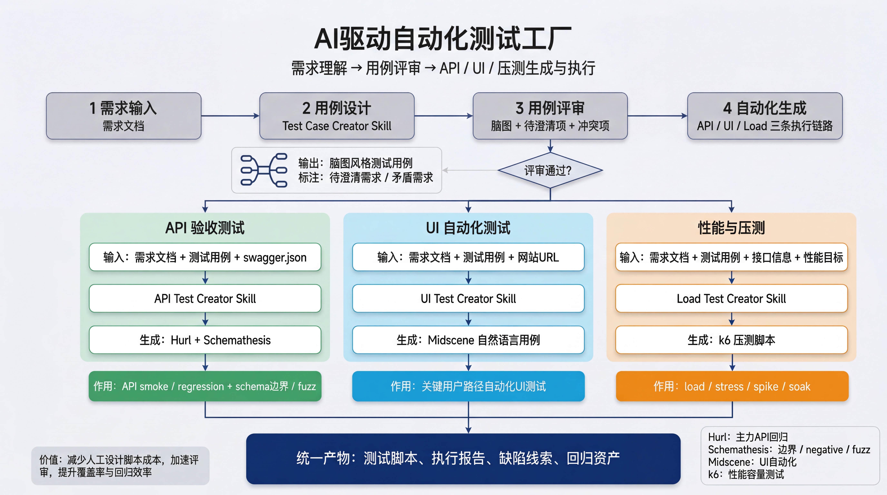

# TestFoundry Skills

AI-native automation testing skillset that turns requirements into review-ready test cases, API tests, UI tests, and load tests.



## 这是什么

一个面向 AI Agent 的测试技能集，包含 4 个 Creator Skills：

- `test-case-creator`
  从需求文档生成测试总览图、模块图、测试矩阵和评审问题清单
- `api-test-creator`
  从已评审测试用例和 `swagger.json` 生成 `Hurl` + `Schemathesis` 资产
- `ui-test-creator`
  从已评审测试用例和网站 URL 生成 `Midscene` 功能用例和视觉评审清单
- `load-test-creator`
  从已评审测试用例和性能目标生成 `k6` 方案与场景骨架

## 先装这个依赖

这 4 个 skill 强依赖官方的 [`playwright-interactive`](https://github.com/openai/skills/tree/main/skills/.curated/playwright-interactive)。

原因很直接：

- 需求文档、Swagger 页面、内网说明页通常需要登录后才能读取
- UI 测试生成依赖真实页面观察，而不是搜索缓存
- 这些 skill 默认会引导 Agent 通过浏览器会话读取内部文档和页面现状

如果没有安装 `playwright-interactive`，这些 skill 在遇到内网文档、登录态页面、真实 UI 上下文时会明显降级，必要时应直接停止并提示先安装依赖。

## 安装

### 1. 安装官方 `playwright-interactive`

Codex 推荐直接用官方安装器：

```text
$skill-installer install https://github.com/openai/skills/tree/main/skills/.curated/playwright-interactive
```

Claude Code 没有这个安装器时，再用手动复制方案：

```bash
git clone --depth=1 --filter=blob:none --sparse https://github.com/openai/skills.git /tmp/openai-skills
git -C /tmp/openai-skills sparse-checkout set skills/.curated/playwright-interactive
```

安装到不同环境时，复制到对应目录：

```bash
# Codex
mkdir -p ~/.codex/skills
cp -R /tmp/openai-skills/skills/.curated/playwright-interactive ~/.codex/skills/

# Claude Code（个人级）
mkdir -p ~/.claude/skills
cp -R /tmp/openai-skills/skills/.curated/playwright-interactive ~/.claude/skills/
```

### 2. 安装 TestFoundry Skills

```bash
git clone https://github.com/quan2005/test-foundry-skills.git
```

复制到你使用的 skills 目录：

```bash
# Codex
cp -R test-foundry-skills/skills/* ~/.codex/skills/

# Claude Code（个人级）
cp -R test-foundry-skills/skills/* ~/.claude/skills/

# Claude Code（项目级）
mkdir -p .claude/skills
cp -R test-foundry-skills/skills/* .claude/skills/
```

## 兼容性

这个仓库保持对 [Claude Code skills](https://code.claude.com/docs/en/skills) 和 [Anthropic Skills standard](https://github.com/anthropics/skills) 的兼容。可移植的核心是 `SKILL.md` 和 supporting files；本仓库另外附带 `agents/openai.yaml` 作为 Codex 的 UI 元数据：

```text
skills/<skill-name>/
├── SKILL.md
├── references/
├── assets/
└── agents/openai.yaml   # Codex-specific, optional for Claude Code
```

兼容策略：

- `SKILL.md` 是核心，兼容 Claude Code 一类基于 Agent Skills 目录约定的运行方式
- `agents/openai.yaml` 是 Codex 的附加 UI 元数据，不影响 Claude Code 使用
- 本仓库用 `skills/` 作为分发根目录，便于复制到 `~/.codex/skills`、`~/.claude/skills` 或 `.claude/skills`

## 怎么用

推荐顺序：

1. `test-case-creator`
   先把需求文档转成测试总览图、模块图、测试矩阵和 `review-issues`
2. 测试用例评审通过后再用：
   - `api-test-creator`
   - `ui-test-creator`
   - `load-test-creator`

默认输出路径：

```text
output/automation-factory/{yyMMdd}_{requirement_slug}/
├── test_cases/
├── api_tests/
├── ui_tests/
└── load_tests/
```

## 校验

```bash
python3 ~/.codex/skills/.system/skill-creator/scripts/quick_validate.py skills/test-case-creator
python3 ~/.codex/skills/.system/skill-creator/scripts/quick_validate.py skills/api-test-creator
python3 ~/.codex/skills/.system/skill-creator/scripts/quick_validate.py skills/ui-test-creator
python3 ~/.codex/skills/.system/skill-creator/scripts/quick_validate.py skills/load-test-creator
```

## 仓库不包含什么

- 不包含生成后的测试产物
- 不包含业务项目代码
- 不包含执行器或 CI 工程

## License

MIT
