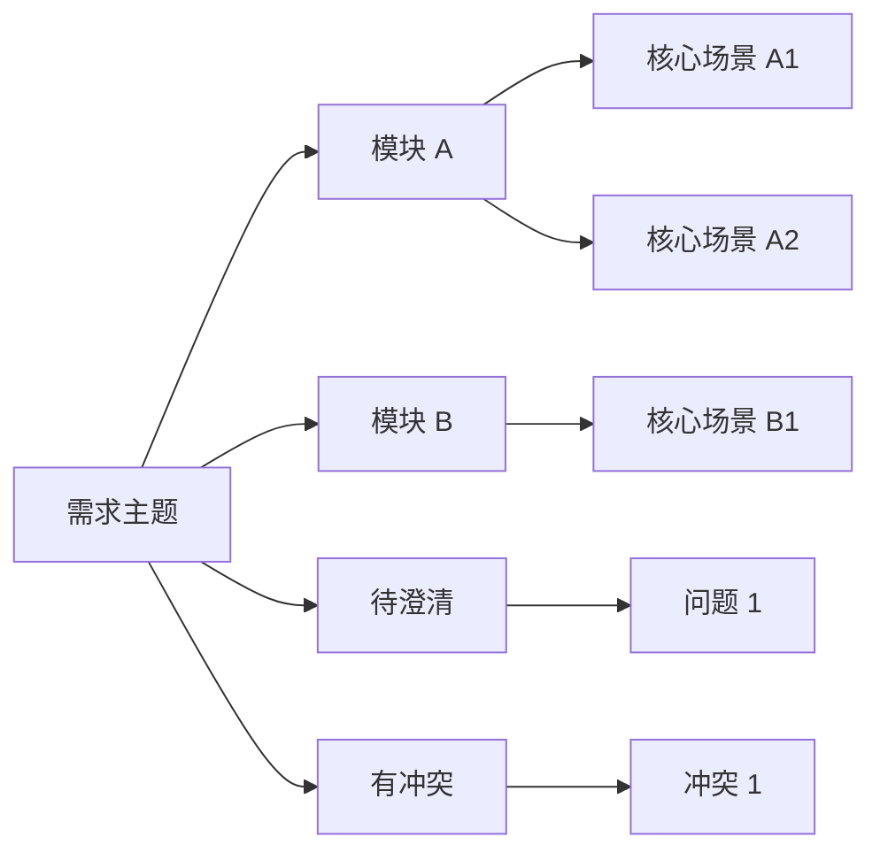

# 测试用例总览图

## 来源

- 需求文档：
- 版本：
- 评审目标：

## 覆盖概览

- 核心模块：
- 核心角色：
- 核心状态：
- 重点异常：
- 重点边界：

## Mermaid 总览图

## 模块图索引

| 文件 | 模块 | 覆盖范围 |
| --- | --- | --- |
| `module-01-*.md` |  |  |
| `module-02-*.md` |  |  |

## 测试矩阵

- 测试矩阵已内嵌在各模块文档中，详见模块图索引中的对应文件。

## 评审结论

- 结论：
- 是否允许进入 API/UI/Performance 生成：
- 备注：
