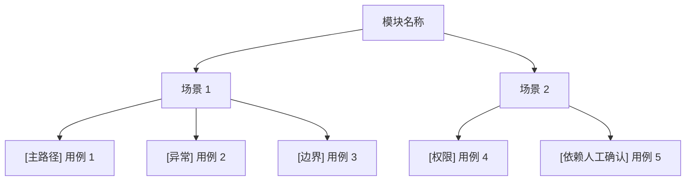

# 模块测试图

## 模块信息

- 模块名称：
- 覆盖目标：
- 关键角色：
- 关键状态：

## Mermaid 模块图

```mermaid
flowchart TB
  M["模块名称"]

  S1["场景 1"]
  C11["[主路径] 用例 1"]
  C12["[异常] 用例 2"]
  C13["[边界] 用例 3"]

  S2["场景 2"]
  C21["[权限] 用例 4"]
  C22["[依赖人工确认] 用例 5"]

  M --> S1
  S1 --> C11
  S1 --> C12
  S1 --> C13

  M --> S2
  S2 --> C21
  S2 --> C22
```

## 场景覆盖说明

| 场景 | 覆盖重点 | 备注 |
| --- | --- | --- |
| 场景 1 |  |  |
| 场景 2 |  |  |

## 关键前置条件

- 

## 依赖与风险

- 
