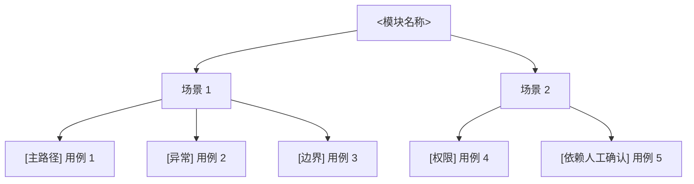

# <模块名称>

## 模块信息

- 模块名称：
- 覆盖目标：
- 关键角色：
- 关键状态：

## Mermaid 模块图

## 场景覆盖说明

| 场景 | 覆盖重点 | 备注 |
| --- | --- | --- |
| 场景 1 |  |  |
| 场景 2 |  |  |

## 关键前置条件

- 

## 依赖与风险

-

## 测试矩阵

| 场景 | 用例 ID | 用例标题 | 类型 | 前置条件 | 预期结果 | 自动化建议 | 备注 |
| --- | --- | --- | --- | --- | --- | --- | --- |
|  | TC-001 |  | 主路径 |  |  | API / UI / Performance / Manual |  |

### 填写说明

- 文档标题直接替换成真实模块名称，不保留“模块测试图”这类泛化标题
- `类型` 统一使用：`主路径`、`异常`、`边界`、`权限`、`依赖人工确认`
- `自动化建议` 用来指向下游 Creator skill 的潜在去向，不在此阶段直接生成脚本
- 如果一条需求无法进入矩阵，必须在 `review-issues.md` 解释原因
- 矩阵只包含本模块的用例，跨模块追踪通过总览图的模块索引完成
