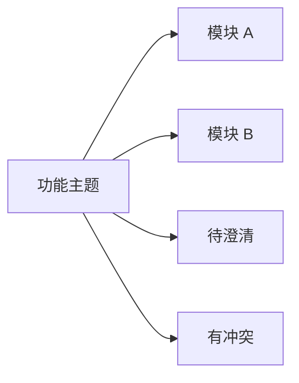
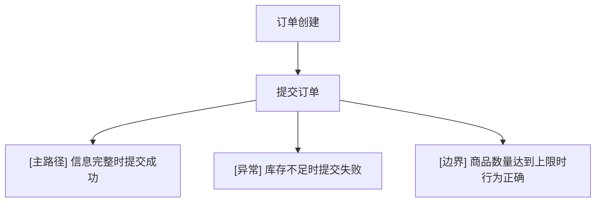

# 测试用例图结构与渲染策略

默认使用 Mermaid `flowchart`，而不是 `mindmap`。目标是把评审视图拆成：

- 1 张总览 Mermaid
- 5 到 6 张模块 Mermaid
- 1 张测试矩阵表

## 总览图规则

- 用 `flowchart LR`
- 只保留：
  - 需求主题
  - 模块分组
  - 关键场景簇
  - 待澄清入口
  - 冲突入口
- 不要把所有用例都放进总览图
- 总览图的主要价值是“让评审先建立全局结构感”

## 模块图规则

- 用 `flowchart TB`
- 一个文件只放一个业务模块
- 场景节点下面再挂用例节点
- 用例标题前固定加轻量标签：
  - `[主路径]`
  - `[异常]`
  - `[边界]`
  - `[权限]`
  - `[依赖人工确认]`
- 如果模块仍然过大，再按二级业务域继续拆图，不要硬塞

示例：

## 测试矩阵规则

- 图只负责建立结构感，矩阵负责完整追踪
- 至少包含这些列：
  - 模块
  - 场景
  - 用例 ID
  - 用例标题
  - 类型
  - 前置条件
  - 预期结果
  - 自动化建议
- 如果某条需求没有进入矩阵，必须进入待澄清或矛盾清单

## 命名建议

- 模块：业务域或页面域，例如“订单管理”“审批中心”
- 场景：用户目标或业务动作，例如“提交申请”“撤回审批”
- 用例：明确测试意图，例如“主路径成功提交”“缺字段失败”“重复提交拦截”

## 标记建议

- 总览图节点文字尽量短，优先写业务名词，不写整句
- 模块图里再展开测试意图
- 待澄清和有冲突单独成簇，不混进业务模块里

不要发明太多标签；优先保持评审可读性和单图信息密度可控。
